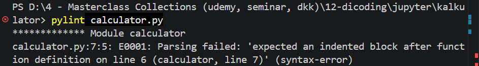
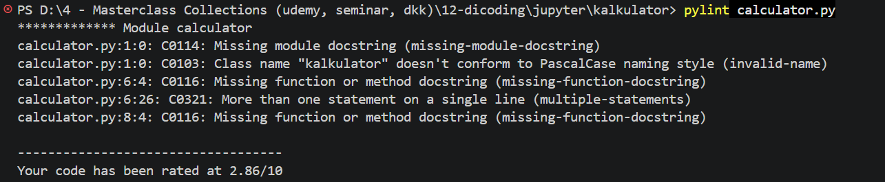
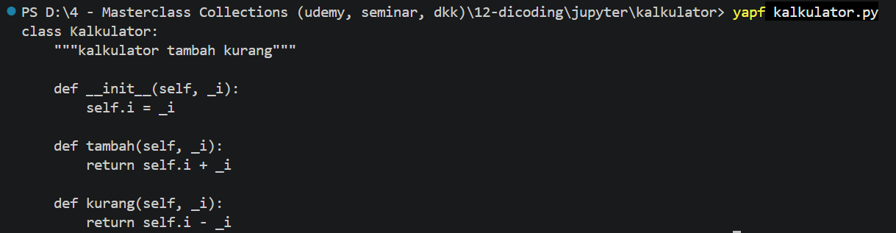
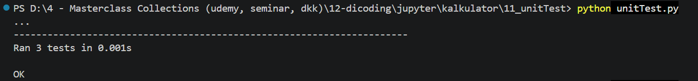
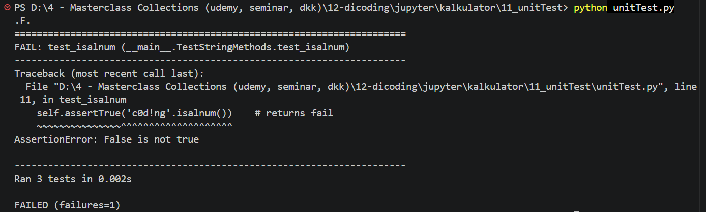

# Introduction

This document is to show my growth mindset process in any programming language I've learned, including Python Fundamentals for this repository.  Eventhough the documentation is not neat and ad hoc due to intense learning process juggling between learning other programming language, reading novels of Manual Docs, and doing some real projects, so I documented my learning here as I possibly could.

### Learning 1: Checking PEP8 Style Guide
**Branch: 10_1_pep8StyleGuide**<br>
In this learning process, I've been introduced with 3 lints, which are pycodestyle, pylint, and flake8.  In this learning process, I've been asked to install 3 of them:
1. Pycodestyle _(before was PEP8)_
```
pip install pycodestyle
```
2. Pylint
```
pip install pylint
```
3. Flake8
```
pip install flake8
```
<br>
After I've install 3 Lint above, I've been instructed to create a new python file called calculator.py, with code below:
```
class Kalkulator:
    """kalkulator tambah kurang"""
    def __init__(self, _i):
        self.i = _i
    def tambah(self, _i): return self.i + _i
    def kurang(self, _i):
    return self.i - _i
```

**Note:** I Accidentally keep the 'return' statement without indentation, to show how this work.<br>

I then run the code above using each lint like above after done installing them:
1. Pycodestyle
    ```
    pycodestyle calculator.py
    ```
    The Output:<br>
    

2. Pylint
    ```
    pylint calculator.py
    ```
    The Output:<br>
    

3. Flake8
    ```
    flake8 calculator.py
    ```
    The Output:<br>
    

From each results above, it does show different error notifications between each lints used.  The errors specified are all the same, which shows indentation error in line 7.<br>
<br>

**The Correct Version of calculator.py Code**<br>
Here's the corrected version of calculator.py after adjust the line 7 with the correct indentation:
```
class kalkulator:
    """kalkulator tambah kurang"""
    def __init__(self, _i):
        self.i = _i
    def tambah(self, _i): return self.i + _i
    def kurang(self, _i):
        return self.i - _i
```
The result of each Lints:
1. Pycodestyle
    ```
    pycodestyle calculator.py
    ```
    The Output: No Errors
2. Flake8
    ```
    flake8 calculator.py
    ```
    The Output: No Errors
3. Pylint
    ```
    pylint calculator.py
    ```
    Result: Shows a docs error<br>
    
<br>
For Point no 1 and 2, when we run the pycodestyle and flake8, it returns no error:<br>

<br>
But on Point no 3 when we run the Pylint, it returns the docs error due to because Pylint requires the developers to specify docstrings documentations between each functions (def in python).  But that's actually fine, does not shows the real technical errors in our programs, just to makesure that our code becomes more perfect in the future.

### Learning 2: Code Formatting
**Branch: 10_2_codeFormatting**<br>
In this learning process, I've been introduced with another 3 application types that are used to format code, which are black, YAPF, and autopep8.  In this learning process, I've been asked to install 3 of them _(but take note, maybe I'll only use one of them)_:
1. Black
    OS Project, developed by Python Software Foundation (PSF) under the MIT license.<br>
    Type this bash to install Black via the cmd or github vscode terminal:
    ```
    pip install black
    ```
2. YAPF _(Yet Another Python Formatter)_
    An OS Project developed under Google with Apache License:
    ```
    pip install yapf
    ```
3. autopep8
    An Open Source (OS) project under the MIT license that uses to format code with the help of lint pycodestyle:
    ```
    pip install autopep8
    ```
For the Code, we're using our previous calculator.py like in the previous chapter on 'Learning 1: Checking PEP8 Style Guide':
```
class Kalkulator:
    """kalkulator tambah kurang"""
    def __init__(self, _i):
        self.i = _i
    def tambah(self, _i): return self.i + _i
    def kurang(self, _i):
        return self.i - _i
```
It consists of 2 methods (consists of tambah _'add'_ and kurang _'minus'_) and an atribute object.<br>
Now, let's try to run the file using the applications we've installed above:<br>
_Open the terminal, type this each and see the result from each command:_
1. black
    ```
    black calculator.py
    ```
    The Output: Automatically beautify the code<br>
    
    ```
    class Calculator:
    """kalkulator tambah kurang"""

    def __init__(self, _i):
        self.i = _i

    def tambah(self, _i):
        return self.i + _i

    def kurang(self, _i):
        return self.i - _i

    ```
2. yapf
    ```
    yapf calculator.py
    ```
    The Output: Shows what code needs to be fixed via the Terminal<br>
    
3. autopep8
    the autopep8 works the same like YAPF and black:
    - yapf: Gives the code recommendations into the terminal
        ```
        autopep8 calculator.py
        ```
        The output: Shows what code needs to be fixed via the Terminal<br>
        
    - black: Directly changes and beautify the codes
        ```
        autopep8 --in-place --aggressive --aggressive calculator.py
        ```
        The Output: Directly changes the calculator.py codes
        ```
        class Kalkulator:
            """kalkulator tambah kurang"""

            def __init__(self, _i):
                self.i = _i

            def tambah(self, _i): return self.i + _i

            def kurang(self, _i):
                return self.i - _i
        ```

### Learning 3: Implement Unit Test with 'Library unittest'
**Branch: 11_2_unitTestLib**<br>
In this branch, I'm learning about implementing Unit Test by using the library unittest.  For this learning process, I've specify my code inside the '11_unitTest' folder directory that contains a file called unitTest.py.  You could rename the file as you want to, but I'll suggest to follow this README docs for my learning insight about using the Python's Library unittest.<br>
This is the first code for my unitTest.py:

#### Unit Test Practice
```
import unittest
 
class TestStringMethods(unittest.TestCase):
    # Ini adalah test case pertama (1)
    def test_strip(self):
        self.assertEqual('www.dicoding.com'.strip('c.mow'), 'dicoding')
    
    # Test case kedua (2)
    def test_isalnum(self):
        self.assertTrue('c0d1ng'.isalnum())     # returns success
        self.assertFalse('c0d!ng'.isalnum())    # returns fail
    
    # Test case ketiga (3)
    def test_index(self):
        s = 'dicoding'
        self.assertEqual(s.index('coding'), 2)
        # cek s.index failed when not found
        with self.assertRaises(ValueError):
            s.index('decode')
    
if __name__ == '__main__':
    # Test Runner
    unittest.main()

```
You can copy & paste it into your VSCode IDE to learn along, and give a file name you want.  I'll just use the unitTest.py.<br>

**The meaning of each code above:**
- **Class TestStringMethods**<br>
    a subclass from unittest.TestCase, to make test process can be run without verbose implementations.
- **3 Methods: test_strip, test_isalnum, test_index**<br>
    As you can see it initiates with 'test' in the beginning of the naming method, where it's mandatory to inform the test runner that "There's a test will be operated".
- **Assert** On every test method, there's an 'assert' that used to makesure each variables are correct.
   - **On Method 'test_strip:'** the assertEqual checker use to makesure the 'www.dicoding.com.strip('c.mow')' is the same as 'dicoding'.
   <details markdown="1"><summary>For those who don't know strip() method and how this assertEqual checker works</summary>
        ...My Stuff
   </details>
   - **On Method 'test_isalnum' _(alnum means alpha-numeric)_:** The assertTrue and assertFalse checker use to makesure if a text contains alpha & numeric is 'correct'.<br>
     - For instance, 'self.assertTrue('cOd1ng'.isalnum())' is correct, because assertTrue() checks the 'cOd1ng' and it contains alpha & numeric.
     - On the other hand, 'self.assertFalse('cOd!ng.isalnum()') is correct, because assertFalse() checks for string that contains other than alpha & numeric.  As you can see, 'cOd!ng' contains a symbol in it.
   - **On Method 'test_index'**: The assertEqual checker use to makesure that on a 'dicoding' char on index 2, the 'coding' char is correct.  Beside that, there's also the assertRaises checker if the index search failed to be found on the specified string.
   - **On the dunder __name__ with unittest.main():** The unittest.main() called to start running the unit test.<br>

When ready, execute the unitTest.py python file:
```
python <file-name>.py
or
python unitTest.py
```
The Output:<br>

<br>
- **What is the '...' tripple dot?**<br>
    After execute the python's Unit Test, it means that those 3 methods are successfully passed the unit test, following with the time '0.001s' running time summary, and ended with the 'OK' Line that marks the Success Unit Test.

#### Trying a Failed Unit Test
Let's try to change this method test_isalnum _(stands for is alpha-numeric)_ on the self.assertFalse to be self.assertTrue:
```
def test_isalnum(self):
    self.assertTrue('c0d1ng'.isalnum())  # This will succeed
    self.assertTrue('c0d!ng'.isalnum())  # This will fail (previously was assertFalse) 
```
Output: Shows an error on self.assertTrue _after change from assertFalse into assertTrue (in my case is in line 11)_:<br>

<br>

**Explanations from what's shown on the Unit Test error above:**<br>
- **The '.F.' :** The 'F' shown means there's a Failed method in this unit test.  The dot is read from left-right, that's align with the method's structure from top-bottom in the class __main__.TestStringMethods.
- **The FAIL Explanation:** It specifies where the method Fails, on a class __main__.TestStringMethods
- **Where's the Code Fails at:** Shows the specific Line of the code that experience Fail in the Unit Test.  The sistem explains that the comparison isn't as expected, where 'AssertionError: False is not True'.
- **Unit Test Time Recap:** Shows '0.002s' to run the unit test, with 3 methods in it, continues specify how many failed methods in the Unit Test that was tested on.