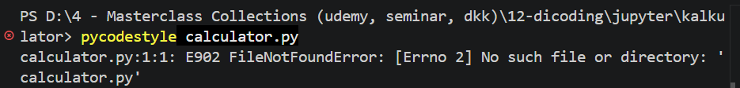

# Introduction

This document is to show my growth mindset process in any programming language I've learned, including Python Fundamentals for this repository.  Eventhough the documentation is not neat and ad hoc due to intense learning process juggling between learning other programming language, reading novels of Manual Docs, and doing some real projects, so I documented my learning here as I possibly could.

### Learning 1: Pengecekan Style Guide PEP8
**Branch: 10_1_pep8StyleGuide**<br>
In this learning process, I've been introduced with 3 lints, which are pycodestyle, pylint, and flake8.  In this learning process, I've been asked to install 3 of them:
1. Pycodestyle _(before was PEP8)_
```
pip install pycodestyle
```
2. Pylint
```
pip install pylint
```
3. Flake8
```
pip install flake8
```
<br>
After I've install 3 Lint above, I've been instructed to create a new python file called calculator.py, with code below:
```
class Kalkulator:
    """kalkulator tambah kurang"""
    def __init__(self, _i):
        self.i = _i
    def tambah(self, _i): return self.i + _i
    def kurang(self, _i):
    return self.i - _i
```

**Note:** I Accidentally keep the 'return' statement without indentation, to show how this work.<br>

I then run the code above using each lint like above after done installing them:
1. Pycodestyle
    ```
    pycodestyle calculator.py
    ```
    The Output:<br>
    
