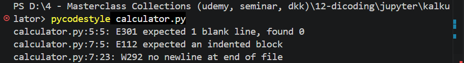
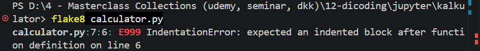
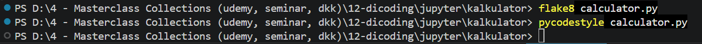
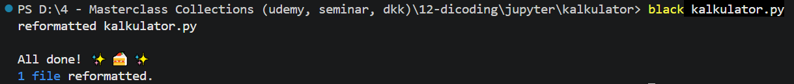

# Introduction

This document is to show my growth mindset process in any programming language I've learned, including Python Fundamentals for this repository.  Eventhough the documentation is not neat and ad hoc due to intense learning process juggling between learning other programming language, reading novels of Manual Docs, and doing some real projects, so I documented my learning here as I possibly could.

### Learning 1: Checking PEP8 Style Guide
**Branch: 10_1_pep8StyleGuide**<br>
In this learning process, I've been introduced with 3 lints, which are pycodestyle, pylint, and flake8.  In this learning process, I've been asked to install 3 of them:
1. Pycodestyle _(before was PEP8)_
```
pip install pycodestyle
```
2. Pylint
```
pip install pylint
```
3. Flake8
```
pip install flake8
```
<br>
After I've install 3 Lint above, I've been instructed to create a new python file called calculator.py, with code below:
```
class Kalkulator:
    """kalkulator tambah kurang"""
    def __init__(self, _i):
        self.i = _i
    def tambah(self, _i): return self.i + _i
    def kurang(self, _i):
    return self.i - _i
```

**Note:** I Accidentally keep the 'return' statement without indentation, to show how this work.<br>

I then run the code above using each lint like above after done installing them:
1. Pycodestyle
    ```
    pycodestyle calculator.py
    ```
    The Output:<br>
    

2. Pylint
    ```
    pylint calculator.py
    ```
    The Output:<br>
    

3. Flake8
    ```
    flake8 calculator.py
    ```
    The Output:<br>
    

From each results above, it does show different error notifications between each lints used.  The errors specified are all the same, which shows indentation error in line 7.<br>
<br>

**The Correct Version of calculator.py Code**<br>
Here's the corrected version of calculator.py after adjust the line 7 with the correct indentation:
```
class kalkulator:
    """kalkulator tambah kurang"""
    def __init__(self, _i):
        self.i = _i
    def tambah(self, _i): return self.i + _i
    def kurang(self, _i):
        return self.i - _i
```
The result of each Lints:
1. Pycodestyle
    ```
    pycodestyle calculator.py
    ```
    The Output: No Errors
2. Flake8
    ```
    flake8 calculator.py
    ```
    The Output: No Errors
3. Pylint
    ```
    pylint calculator.py
    ```
    Result: Shows a docs error<br>
    
<br>
For Point no 1 and 2, when we run the pycodestyle and flake8, it returns no error:<br>

<br>
But on Point no 3 when we run the Pylint, it returns the docs error due to because Pylint requires the developers to specify docstrings documentations between each functions (def in python).  But that's actually fine, does not shows the real technical errors in our programs, just to makesure that our code becomes more perfect in the future.

### Learning 2: Code Formatting
**Branch: 10_2_codeFormatting**<br>
In this learning process, I've been introduced with another 3 application types that are used to format code, which are black, YAPF, and autopep8.  In this learning process, I've been asked to install 3 of them _(but take note, maybe I'll only use one of them)_:
1. Black
    OS Project, developed by Python Software Foundation (PSF) under the MIT license.<br>
    Type this bash to install Black via the cmd or github vscode terminal:
    ```
    pip install black
    ```
2. YAPF _(Yet Another Python Formatter)_
    An OS Project developed under Google with Apache License:
    ```
    pip install yapf
    ```
3. autopep8
    An Open Source (OS) project under the MIT license that uses to format code with the help of lint pycodestyle:
    ```
    pip install autopep8
    ```
For the Code, we're using our previous calculator.py like in the previous chapter on 'Learning 1: Checking PEP8 Style Guide':
```
class Kalkulator:
    """kalkulator tambah kurang"""
    def __init__(self, _i):
        self.i = _i
    def tambah(self, _i): return self.i + _i
    def kurang(self, _i):
        return self.i - _i
```
It consists of 2 methods (consists of tambah _'add'_ and kurang _'minus'_) and an atribute object.<br>
Now, let's try to run the file using the applications we've installed above:<br>
_Open the terminal, type this each and see the result from each command:_
1. black
    ```
    black calculator.py
    ```
    The Output: Automatically beautify the code<br>
    
    ```
    class Calculator:
    """kalkulator tambah kurang"""

    def __init__(self, _i):
        self.i = _i

    def tambah(self, _i):
        return self.i + _i

    def kurang(self, _i):
        return self.i - _i

    ```
2. yapf
    ```
    yapf calculator.py
    ```
    The Output: Shows what code needs to be fixed via the Terminal<br>
    
3. autopep8
    the autopep8 works the same like YAPF and black:
    - yapf: Gives the code recommendations into the terminal
        ```
        autopep8 calculator.py
        ```
        The output: Shows what code needs to be fixed via the Terminal<br>
        
    - black: Directly changes and beautify the codes
        ```
        autopep8 --in-place --aggressive --aggressive calculator.py
        ```
        The Output: Directly changes the calculator.py codes
        ```
        class Kalkulator:
            """kalkulator tambah kurang"""

            def __init__(self, _i):
                self.i = _i

            def tambah(self, _i): return self.i + _i

            def kurang(self, _i):
                return self.i - _i
        ```
 